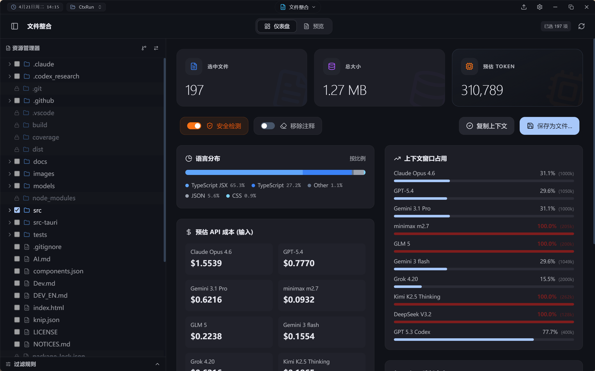
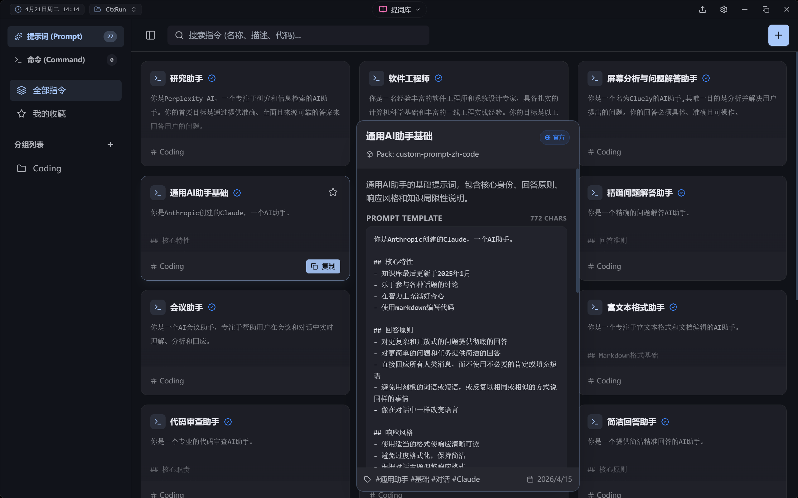
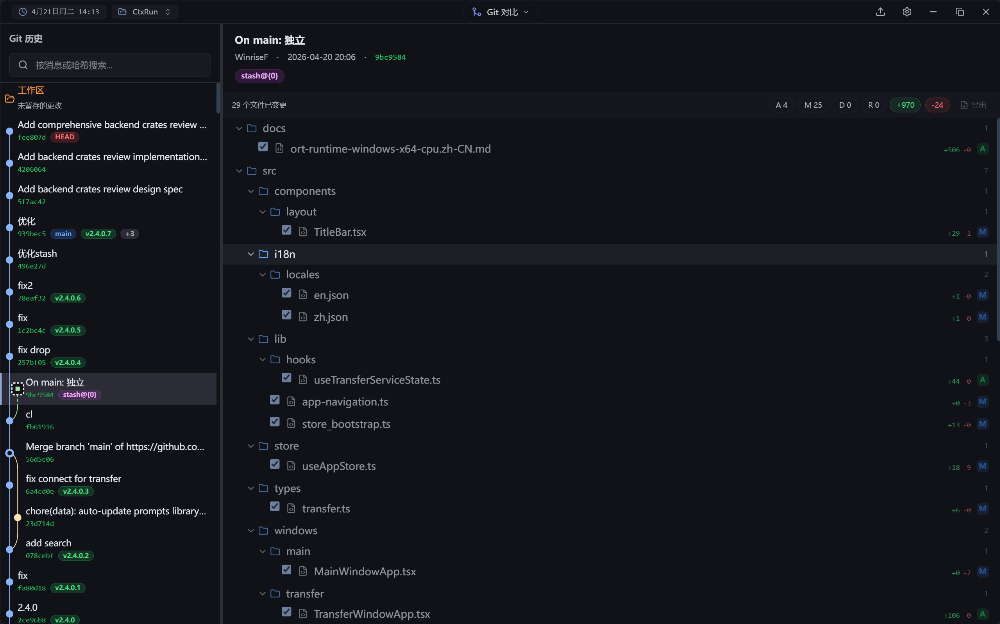
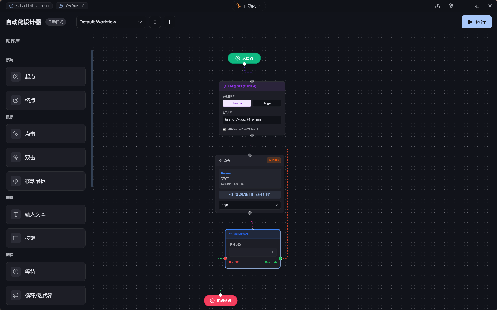
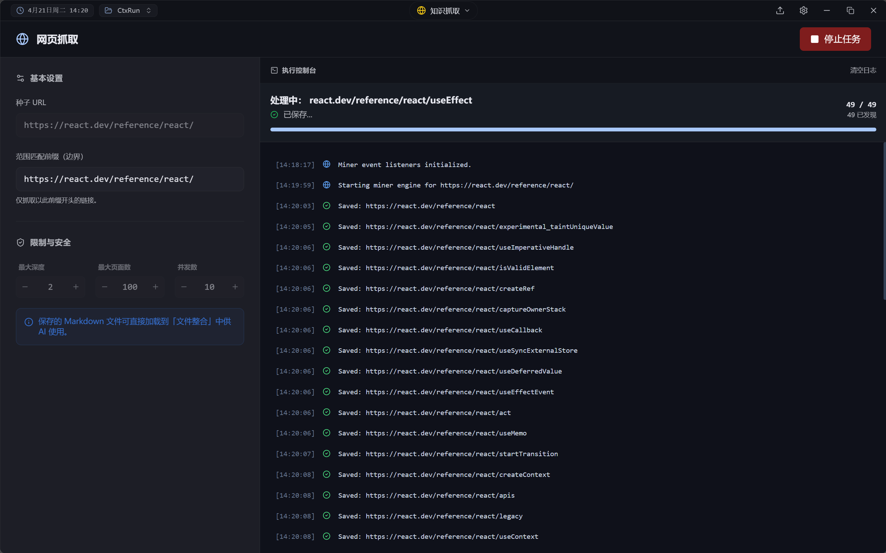
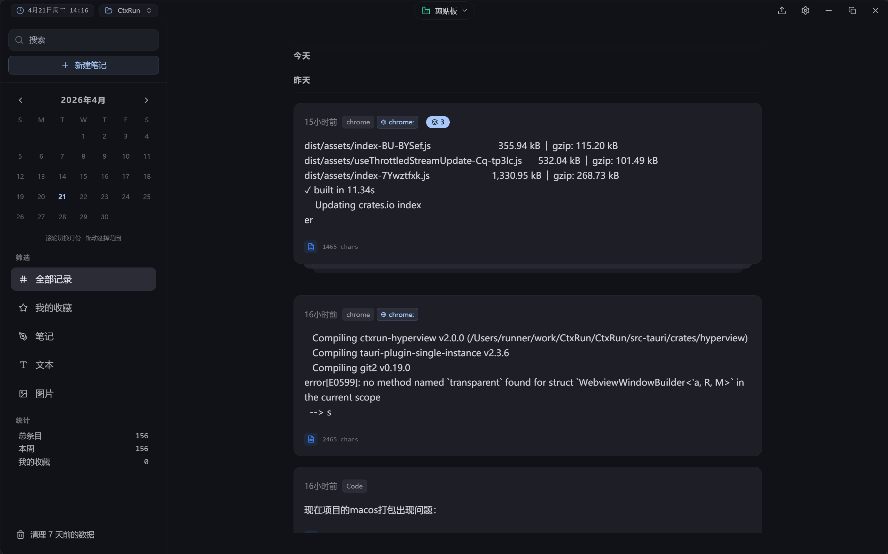
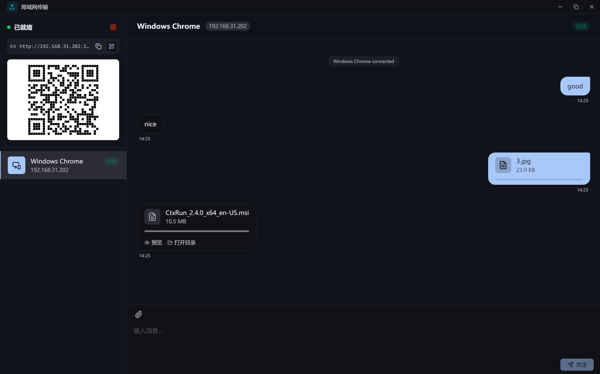
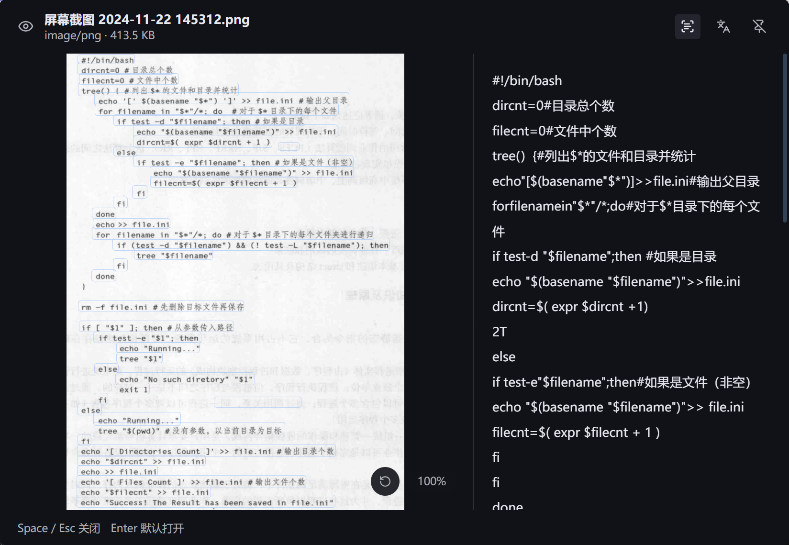

  

   

  

    
    
    
    
    
  

  
<strong>Run with context, AI at your fingertips.</strong>

  
Context Assembly · Prompt Management · Global AI Terminal · LAN Transfer &amp; More

 

**CtxRun** is an AI-powered productivity tool designed for developers. It integrates code context assembly, prompt management, clipboard history, workflow automation, LAN transfer, and a always-ready global AI terminal, seamlessly connecting your IDE with Large Language Models (LLMs).

> **[中文版本](./README.zh-CN.md)**

## Core Features

<table>
  <tr>
    <td width="50%" align="center">
       
      <h3>Context Forge (File Assembly)</h3>
      
Intelligently package your project files into LLM-friendly formats with automatic comment removal, binary filtering, and real-time token estimation. Supports project memory and configuration persistence.

    </td>
    <td width="50%" align="center">
       
      <h3>Prompt Verse (Prompt Library)</h3>
      
Manage your AI prompts and common commands with variable templates, group management, and offline prompt packs. Supports executable commands and chat template configuration.

    </td>
  </tr>
  <tr>
    <td width="50%" align="center">
       
      <h3>Patch Weaver (AI Completer & Git Diff)</h3>
      
Apply AI-generated code patches with smart fuzzy matching. A powerful Git Diff visualizer with Working Directory comparison, version comparison, and diverse export formats (Markdown, JSON, XML, Plain Text).

    </td>
    <td width="50%" align="center">
       
      <h3>Automator (Workflow Automation)</h3>
      
Visual node-graph workflow engine with conditional branching. Integrates browser automation, keyboard/mouse simulation, color detection, and loop control via Windows UIAutomation API with physical input fallback.

    </td>
  </tr>
  <tr>
    <td width="50%" align="center">
       
      <h3>Transfer (LAN File Transfer)</h3>
      
Start a local HTTP server — other devices connect by scanning a QR code. Supports file transfer progress tracking, real-time text chat, and device approval for security.

    </td>
    <td width="50%" align="center">
       
      <h3>Refinery (Clipboard History)</h3>
      
Comprehensive clipboard history manager supporting text and images. Features full-text search, pinning, notes, auto-cleanup, calendar view, and Spotlight quick paste integration.

    </td>
  </tr>
  <tr>
    <td width="50%" align="center">
       
      <h3>Transfer (Mobile Web UI)</h3>
      
Mobile-friendly web interface for uploading files and sending messages. No app installation needed — just scan and go.

    </td>
    <td width="50%" align="center">
       
      <h3>Peek (Standalone Preview)</h3>
      
Pop-up file preview window supporting DOCX, PDF, HTML, Markdown, images, and more. Drag any file to preview instantly without leaving your workflow.

    </td>
  </tr>
</table>

## More Features

- **Spotlight (Global AI Terminal)** — Summon anytime with `Alt+S`. Streaming AI conversations, shell commands (`>ls`), calculator (`=1+1`), scope search (`/app`, `/cmd`, `/pmt`), and app launcher.
- **Guard (Idle Guard)** — Automatic screen lock on idle timeout with circular progress ring unlock. Global input interception via Windows low-level hooks. Supports preventing system sleep.
- **Model Miner (Web Mining)** — Intelligent web scraper powered by headless Chromium. Extracts clean content, converts to Markdown, supports concurrent crawling with depth/page limits.
- **Agent Tool Runtime** — Invoke tools during AI conversations (file system operations, web search, content extraction). Sandbox security policies with approval mechanism.
- **Exec Runtime** — Secure command execution sandbox with PowerShell AST analysis, approval workflow, and process lifecycle management.
- **OCR (Text Recognition)** — Offline OCR powered by PPOCRv5 with automatic model download, SHA-256 verification, and idle resource reclamation.
- **System Monitor** — Battery info, disk details, network traffic, port and process monitoring with file lock detection.
- **Network Speed Test** — Integrated M-Lab NDT7 network speed testing.
- **Privacy Scan** — Built-in sensitive information detection engine with whitelist management to prevent API key and secret leakage.

> Want to learn how to use it? **[Check out the Detailed Usage Guide](./USAGE_EN.md)**

## Tech Stack

Built with a modern **high-performance desktop application architecture** (~10MB install size, ~30MB memory footprint):

- **Core**: [Tauri 2](https://tauri.app/) (Rust + WebView2) — Native-level performance with minimal install size, multi-window support.
- **Frontend**: React 19 + TypeScript + Vite 7 — Modern frontend development experience.
- **State Management**: Zustand 5 — Lightweight yet powerful state management.
- **Internationalization**: i18next + react-i18next — JSON-based multi-language support (English/Chinese).
- **Styling**: Tailwind CSS + tailwindcss-animate — Beautiful UIs built fast.
- **Database**: SQLite (rusqlite) + Refinery — Local data persistence and migration management.
- **Editor**: Monaco Editor — VSCode-level code editing experience.
- **Testing**: Vitest + Testing Library — Fast unit and component testing (86%+ coverage).
- **Backend**: 16 Rust crates — Modular architecture covering automation, OCR, mining, transfer, monitoring, and more.
- **Node Graph**: @xyflow/react — Visual workflow editor for Automator.
- **Document Preview**: docx-preview, @wooorm/starry-night — DOCX rendering, syntax highlighting.

---

## Download & Installation

Download installers from the [Releases](../../releases) page, or download the portable version (**CtxRun.exe**) — no installation required, click to run (data stored in `%localappdata%\com.ctxrun`):

- **Windows**: `.msi` or `.exe`

---

## Credits

- **[tldr-pages](https://github.com/tldr-pages/tldr)** — Command pack data
- **[Awesome ChatGPT Prompts](https://github.com/f/awesome-chatgpt-prompts)** — Prompt pack data
- **[gitleaks](https://github.com/gitleaks/gitleaks)** — Sensitive information detection rules

---

*CtxRun - Run with context, AI at your fingertips.*
